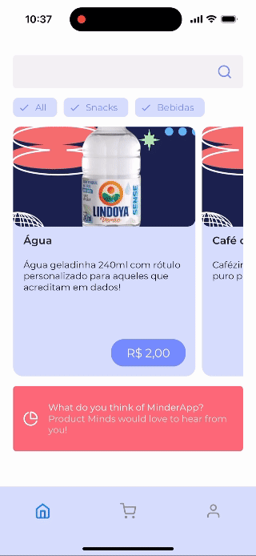
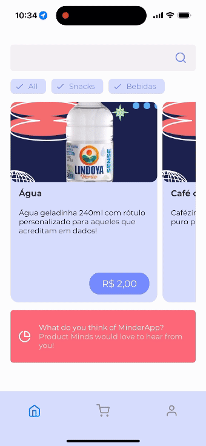

# In App Templates

Welcome to the Product Minds In-App Templates Repository!

Our collection of in-app templates is designed to supercharge your app development process. Whether you're a seasoned developer or just starting out, our templates provide you with a solid foundation to create stunning, user-friendly interfaces in no time.

Stay connected with Product Minds:  
Website: productminds.com  
Email for support: tech@productminds.io 

## Previews

Herebelow there is the description and preview as a GIF of each of the templates we have available and how this is seen on mobile devices.

### **NPS Survey**

  This template provides the user with the possibility of selecting a score from 1 to 5 and give feedback as a free form in the cases the user has responded from 4 to 5, to finally show them the confirmation page.

  

### **Rate US with stars**

  This template provides the user with the possibility of rating *something* on a scale of 1 to 5 stars. This In App uses the fontawesome library for the style of the stars. Once, it is selected and uploaded the confirmation page is showed to the user.

  

### **Rate US with emojis**

  This template provides the user with the possibility of rating *something* on a scale of emojis being the worst score: 😡 and the best: 😊. Once, it is selected and uploaded the confirmation page is showed to the user.

  

## How to customize it

You should customize the variables inside script. We have the following options:

### JS variables

#### General variables

<table>
  <tr>
    <th>Variable</th>
    <th>Description</th>
    <th>Default value</th>
  </tr>
  <tr>
    <td>SURVEY_ID</td>
    <td>Unique id for this specific survey</td>
    <td>default-survey</td>
  </tr>
  <tr>
    <td>LOGO_URL</td>
    <td>The url of the brand logo</td>
    <td>Product Minds Logo</td>
  </tr>
  <tr>
    <td>TITLE</td>
    <td>The title of survey</td>
    <td>We want to know your opinion, {{${first_name} | default: 'Minder' }}!</td>
  </tr>
  <tr>
    <td>SUBTITLE</td>
    <td>The subtitle of survey</td>
    <td>Which score best describe your experience with MinderApp?</td>
  </tr>
  <tr>
    <td>BUTTON_TEXT</td>
    <td>The text of submit button</td>
    <td>Submit</td>
  </tr>
  <tr>
    <td>CLOSE_PRIMARY_BUTTON_TEXT</td>
    <td>The text of close primary button</td>
    <td>Close</td>
  </tr>
  <tr>
    <td>FEEDBACK_TITLE</td>
    <td>The title of feedback</td>
    <td>Thank you!</td>
  </tr>
  <tr>
    <td>FEEDBACK_SUBTITLE</td>
    <td>The subtitle of feedback</td>
    <td>We are constantly improving our product</td>
  </tr>
</table>

#### NPS - Specific variables

<table>
  <tr>
    <th>Variable</th>
    <th>Description</th>
    <th>Default value</th>
  </tr>
  <tr>
    <td>SCORES_LEGEND_LEFT</td>
    <td>Legend of left value for NPS</td>
    <td>Bad</td>
  </tr>
    <tr>
    <td>SCORES_LEGEND_RIGHT</td>
    <td>Legend of right value for NPS</td>
    <td>Good</td>
  </tr>
</table>

### Styling (CSS variables)

#### General variables

<table>
  <tr>
    <th>CSS Variable</th>
    <th>Description</th>
    <th>Default value</th>
  </tr>
  <tr>
    <td>--space</td>
    <td>The default space size used</td>
    <td>15px</td>
  </tr>
  <tr>
    <td>--max-container-width</td>
    <td>The max container width</td>
    <td>500px</td>
  </tr>
  <tr>
    <td>--font-size</td>
    <td>Default font size</td>
    <td>#eaeaea</td>
  </tr>
  <tr>
    <td>--main-grey</td>
    <td>Main grey color</td>
    <td>#eaeaea</td>
  </tr>
  <tr>
    <td>--dark-grey</td>
    <td>Dark grey color</td>
    <td>#cccccc</td>
  </tr>
  <tr>
    <td>--main-black</td>
    <td>Main black color</td>
    <td>#2f2f2f</td>
  </tr>
  <tr>
    <td>--main-white</td>
    <td>Main white color</td>
    <td>#eaeaea</td>
  </tr>
  <tr>
    <td>--main-orange</td>
    <td>Main orange color</td>
    <td>#ff9010</td>
  </tr>
  <tr>
    <td>--main-blue</td>
    <td>Main blue color</td>
    <td>16px</td>
  </tr>
  <tr>
    <td>--background-color</td>
    <td>Background modal color</td>
    <td>--main-grey</td>
  </tr>
  <tr>
    <td>--primary-color</td>
    <td>Primary color used</td>
    <td>--main-blue</td>
  </tr>
  <tr>
    <td>--close-button-color</td>
    <td>Close button color</td>
    <td>--background-color</td>
  </tr>
  <tr>
    <td>--close-button-text-color</td>
    <td>Close button text color</td>
    <td>--dark-grey</td>
  </tr>
  <tr>
    <td>--submit-button-color</td>
    <td>Submit button color</td>
    <td>--primary-color</td>
  </tr>
  <tr>
    <td>--submit-button-disabled-color</td>
    <td>Submit button disabled color</td>
    <td>--dark-grey</td>
  </tr>
  <tr>
    <td>--submit-button-disabled-text-color</td>
    <td>Submit button disabled text color</td>
    <td>--main-white</td>
  </tr>
  <tr>
    <td>--submit-button-text-color</td>
    <td>Submit button text color</td>
    <td>--main-white</td>
  </tr>
  <tr>
    <td>--title-color</td>
    <td>Title color</td>
    <td>--main-black</td>
  </tr>
  <tr>
    <td>--subtitle-color</td>
    <td>Subtitle color</td>
    <td>--main-black</td>
  </tr>
</table>

#### NPS - Specific variables

<table>
  <tr>
    <th>CSS Variable</th>
    <th>Description</th>
    <th>Value</th>
  </tr>
  <tr>
    <td>--scores-color</td>
    <td>Color of each score div</td>
    <td>--dark-grey</td>
  </tr>
  <tr>
    <td>--scores-text-color</td>
    <td>Color of text inside score div</td>
    <td>--main-white</td>
  </tr>
  <tr>
    <td>--scores-selected-color</td>
    <td>Color of scores when selected</td>
    <td>--primary-color</td>
  </tr>
  <tr>
    <td>--scores-selected-text-color</td>
    <td>Color of score text when selected</td>
    <td>--main-white</td>
  </tr>
  <tr>
    <td>--scores-legend-text-color</td>
    <td>Color of legend text color</td>
    <td>--main-black</td>
  </tr>
</table>

## To use it

When interacting with the surveys, the code will do the following:

- Log a custom event with the name `survey.completed` with these properties:
  - score: SELECTED SCORE
  - survey_id - SURVEY ID DEFINED
  - url: window.location.href
- Set a custom property with the name `survey.${SURVEY_ID}.score` on user profile. The value is the score selected.
- Log a custom event with the name `survery.dismiss` with these properties:
  - score: SELECTED SCORE (if its exists)
  - survey_id: SURVEY ID DEFINED
  - url: window.location.href
