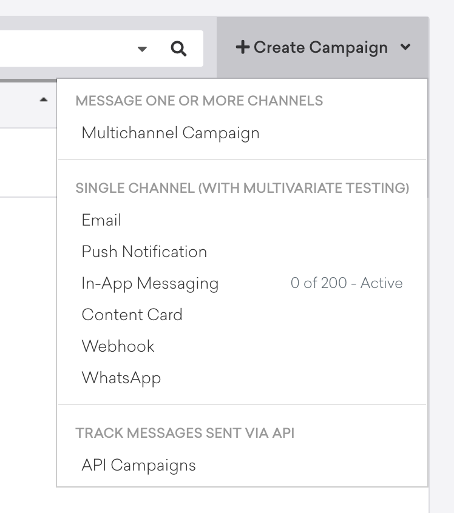
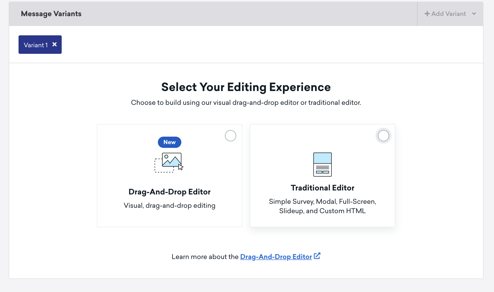
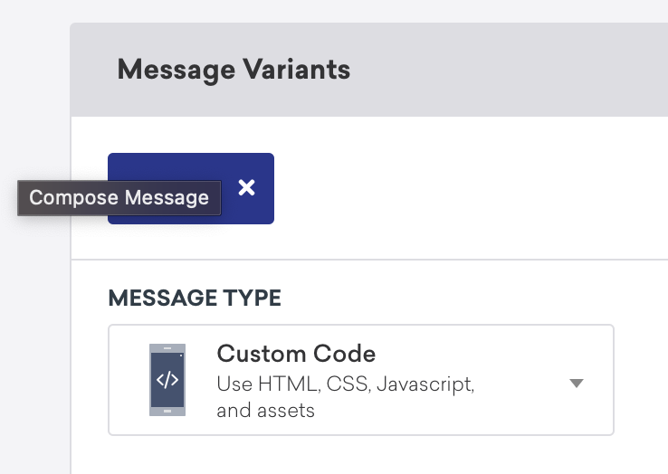
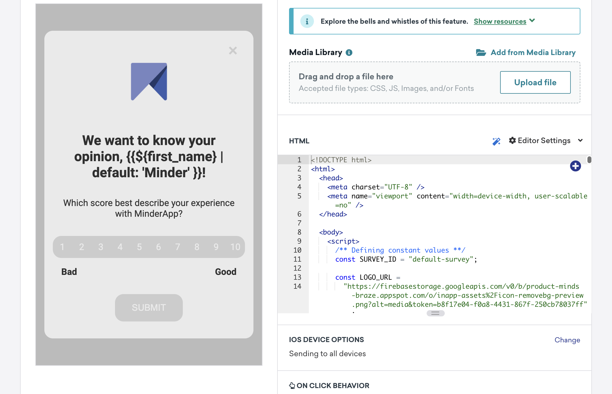
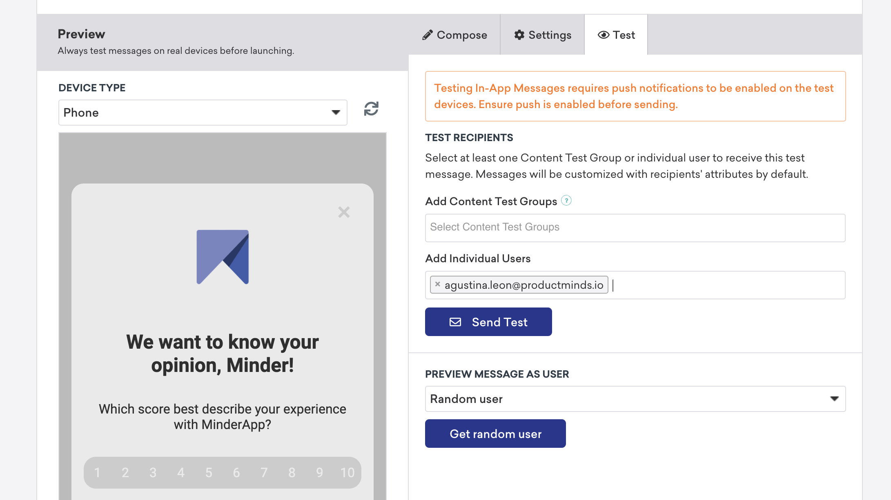
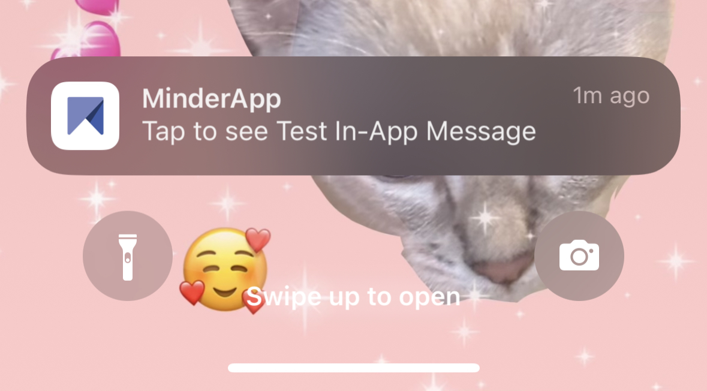

# In App Templates

Welcome to the Product Minds In-App Templates Repository!

Our collection of in-app templates is designed to supercharge your app development process. Whether you're a seasoned developer or just starting out, our templates provide you with a solid foundation to create stunning, user-friendly interfaces in no time.

Stay connected with Product Minds:  
Website: productminds.com  
Email for support: tech@productminds.io 

## 📱 Previews

Herebelow there is the description and preview as a GIF of each of the templates we have available and how this is seen on mobile devices.

### 🏅 **NPS Survey**

  This template provides the user with the possibility of selecting a score from 1 to 10. Once it is selected and uploaded the confirmation page is showed to the user.

  

### ⭐ **Rate us with stars**

  This template provides the user with the possibility of rating *something* on a scale of 1 to 10 stars. This In App uses the fontawesome library for the style of the stars. Once it is selected and uploaded the confirmation page is showed to the user.

  

### 😀 **Rate us with emojis**

  This template provides the user with the possibility of rating *something* on a scale of emojis being the worst score: 😡 and the best: 😊. Once it is selected and uploaded the confirmation page is showed to the user.

  

## 🎨 How to customize it

You should customize the variables inside script. We have the following options:

### JS variables

- #### General variables

<table>
  <tr>
    <th>Variable</th>
    <th>Description</th>
    <th>Default value</th>
  </tr>
  <tr>
    <td>SURVEY_ID</td>
    <td>Unique id for this specific survey</td>
    <td>default-survey</td>
  </tr>
  <tr>
    <td>LOGO_URL</td>
    <td>The url of the brand logo</td>
    <td>Product Minds Logo</td>
  </tr>
  <tr>
    <td>TITLE</td>
    <td>The title of survey</td>
    <td>We want to know your opinion, {{${first_name} | default: 'Minder' }}!</td>
  </tr>
  <tr>
    <td>SUBTITLE</td>
    <td>The subtitle of survey</td>
    <td>Which score best describe your experience with MinderApp?</td>
  </tr>
  <tr>
    <td>BUTTON_TEXT</td>
    <td>The text of submit button</td>
    <td>Submit</td>
  </tr>
  <tr>
    <td>CLOSE_PRIMARY_BUTTON_TEXT</td>
    <td>The text of close primary button</td>
    <td>Close</td>
  </tr>
  <tr>
    <td>FEEDBACK_TITLE</td>
    <td>The title of feedback</td>
    <td>Thank you!</td>
  </tr>
  <tr>
    <td>FEEDBACK_SUBTITLE</td>
    <td>The subtitle of feedback</td>
    <td>We are constantly improving our product</td>
  </tr>
</table>

- #### NPS - Specific variables

<table>
  <tr>
    <th>Variable</th>
    <th>Description</th>
    <th>Default value</th>
  </tr>
  <tr>
    <td>SCORES_LEGEND_LEFT</td>
    <td>Legend of left value for NPS</td>
    <td>Bad</td>
  </tr>
    <tr>
    <td>SCORES_LEGEND_RIGHT</td>
    <td>Legend of right value for NPS</td>
    <td>Good</td>
  </tr>
</table>

### Styling (CSS variables)

- #### General variables

<table>
  <tr>
    <th>CSS Variable</th>
    <th>Description</th>
    <th>Default value</th>
  </tr>
  <tr>
    <td>--space</td>
    <td>The default space size used</td>
    <td>15px</td>
  </tr>
  <tr>
    <td>--max-container-width</td>
    <td>The max container width</td>
    <td>500px</td>
  </tr>
  <tr>
    <td>--font-size</td>
    <td>Default font size</td>
    <td>#eaeaea</td>
  </tr>
  <tr>
    <td>--main-grey</td>
    <td>Main grey color</td>
    <td>#eaeaea</td>
  </tr>
  <tr>
    <td>--dark-grey</td>
    <td>Dark grey color</td>
    <td>#cccccc</td>
  </tr>
  <tr>
    <td>--main-black</td>
    <td>Main black color</td>
    <td>#2f2f2f</td>
  </tr>
  <tr>
    <td>--main-white</td>
    <td>Main white color</td>
    <td>#eaeaea</td>
  </tr>
  <tr>
    <td>--main-orange</td>
    <td>Main orange color</td>
    <td>#ff9010</td>
  </tr>
  <tr>
    <td>--main-blue</td>
    <td>Main blue color</td>
    <td>16px</td>
  </tr>
  <tr>
    <td>--background-color</td>
    <td>Background modal color</td>
    <td>--main-grey</td>
  </tr>
  <tr>
    <td>--primary-color</td>
    <td>Primary color used</td>
    <td>--main-blue</td>
  </tr>
  <tr>
    <td>--close-button-color</td>
    <td>Close button color</td>
    <td>--background-color</td>
  </tr>
  <tr>
    <td>--close-button-text-color</td>
    <td>Close button text color</td>
    <td>--dark-grey</td>
  </tr>
  <tr>
    <td>--submit-button-color</td>
    <td>Submit button color</td>
    <td>--primary-color</td>
  </tr>
  <tr>
    <td>--submit-button-disabled-color</td>
    <td>Submit button disabled color</td>
    <td>--dark-grey</td>
  </tr>
  <tr>
    <td>--submit-button-disabled-text-color</td>
    <td>Submit button disabled text color</td>
    <td>--main-white</td>
  </tr>
  <tr>
    <td>--submit-button-text-color</td>
    <td>Submit button text color</td>
    <td>--main-white</td>
  </tr>
  <tr>
    <td>--title-color</td>
    <td>Title color</td>
    <td>--main-black</td>
  </tr>
  <tr>
    <td>--subtitle-color</td>
    <td>Subtitle color</td>
    <td>--main-black</td>
  </tr>
</table>

- #### NPS - Specific variables

<table>
  <tr>
    <th>CSS Variable</th>
    <th>Description</th>
    <th>Value</th>
  </tr>
  <tr>
    <td>--scores-color</td>
    <td>Color of each score div</td>
    <td>--dark-grey</td>
  </tr>
  <tr>
    <td>--scores-text-color</td>
    <td>Color of text inside score div</td>
    <td>--main-white</td>
  </tr>
  <tr>
    <td>--scores-selected-color</td>
    <td>Color of scores when selected</td>
    <td>--primary-color</td>
  </tr>
  <tr>
    <td>--scores-selected-text-color</td>
    <td>Color of score text when selected</td>
    <td>--main-white</td>
  </tr>
  <tr>
    <td>--scores-legend-text-color</td>
    <td>Color of legend text color</td>
    <td>--main-black</td>
  </tr>
</table>

## 🔍 How data is tracked in Braze?

When interacting with the surveys, the code will do the following:

- **Log a custom event with the name `survey.completed`**

WHEN?

When the user clicks on the SAVE button

PROPERTIES

<ul style="margin-left:50px;">
  <li>score: SELECTED SCORE</li>
  <li>survey_id: SURVEY ID DEFINED</li>
  <li>url: window.location.href</li>
</ul>

NEXT?

The feedback screen is shown

- **Set a custom user attribute with the name `survey.${SURVEY_ID}.score`**

WHEN?

When the user clicks on the SAVE button

VALUE

The score selected transformed it to a number

- **Log a custom event with the name `survey.dismiss`**

WHEN?

When the user clicks on the CLOSE button in the feedback screen or the cross on the left right on every screen.

PROPERTIES

<ul style="margin-left:50px;">
  <li>score: SELECTED SCORE (*if available*)</li>
  <li>survey_id: SURVEY ID DEFINED</li>
  <li>url: window.location.href</li>
</ul>

NEXT?

The In App Message is closed

## 👀 How do I test this?

1. Download the HTML from this repository. If you are new to GIT you can download all of our packages as a ZIP clicking on the **<> Code** button and then on Download ZIP.

  

2. Copy the HTML content of the template you want to use.

3. Open the Braze dashboard and create a new In App Messaging Campaign

  

4. On the First Step of the carving of the campaign: Compose Messages, go to the **Message Variants** tab and select the option of **Traditional Editor**. Then select **Custom Code**.

  
  

5. Continue on the First Step, go to the **Preview** tab and got to the paste the HTML content you copied on the 2nd step into the HTML input of the message.

  

6. In the **Preview** tab, go to the **Test** tab and enter the External ID or Email to identify your user or device in Braze. Send the test.

  

7. If everything went ok, you will receive a push notification to your device. Click on it and Braze will open your App and show to you the In App Message you are testing.

  

